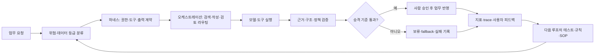

# AI Harness, Orchestration & Loop Engineering

생성형 AI를 업무에 붙일 때 모델 이름보다 먼저 설계해야 할 운영 구조를 정리한 포트폴리오입니다.

이 저장소는 개인 개발환경과 프로젝트에서 구성·시험한 방식을 공개한 것입니다. 특정 기업의 내부 시스템에 적용한 성과나 모델 정확도·생산성을 주장하지 않습니다. 대신 AI가 무엇을 보고, 어떤 도구를 호출하고, 언제 멈추며, 누가 결과를 승인하고, 실패가 다음 실행에 어떻게 반영되는지를 설명합니다.

## 한눈에 보는 구조



## 세 가지 설계

### Harness engineering

AI에게 더 긴 프롬프트를 주는 일이 아니라, 모델이 움직일 수 있는 경계를 설계하는 일입니다.

- 입력 자료의 등급과 출처
- 읽기·쓰기·외부 전송 권한
- 허용 도구와 호출 순서
- 구조화된 출력 계약과 근거 필드
- 중단 조건, 수동 fallback, 최종 승인자
- 실행 기록과 개인정보·비밀값 제외 정책

### Orchestration

하나의 모델에 모든 판단을 맡기지 않고 업무의 역할을 나눕니다. 예를 들어 요청 분류 → 승인된 문서 검색 → 초안 작성 → 규칙 검증 → 담당자 검토 → 확정 반영의 순서를 정합니다. 단순한 업무에는 단일 호출을 쓰고, 위험하거나 긴 업무에는 검토자·승인자·독립 검증을 추가합니다.

### Loop engineering

한 번 잘 나온 답보다 다음 실행이 더 나아지는 구조를 만듭니다.

1. 기준선과 성공·실패 조건을 고정합니다.
2. 작은 파일럿을 동일 조건으로 실행합니다.
3. 결과, 근거, 수정 내용, 실패 원인을 남깁니다.
4. 사람 검토와 자동 평가로 승격·보류·롤백을 결정합니다.
5. 실패 사례를 테스트 케이스·프롬프트·규칙·SOP에 반영합니다.

## 업무 파일럿 예시

`examples/pilot-charter.md`에는 제조·품질·고객지원 환경에서 검토할 수 있는 승인 문서 Q&A, 검사 기록 요약, 고객 이슈 초안의 파일럿 계약을 적었습니다. 실제 데이터 대신 비식별·가상 입력만 사용하고, 먼저 볼 KPI와 보류 조건을 함께 둡니다.

## 프로젝트에 적용한 방식

이 구조는 제조 파일럿만을 위한 이론이 아닙니다. `StockPulse AI`, `quiz-validator`, `Strategy Arena`, `realestate-economy`, `Document Forge`, `company-news-analyzer`, `KRA/keirin EV`, `codex-global-skills`, `Sentinel-30`, `we-meet`, SSAFY 프로젝트, 현재 Jupyter 모델 실험에 각각 다른 형태로 적용했습니다. 프로젝트별로 어떤 역할을 어떤 순서로 배치했는지, 무엇을 차단했는지, 실패를 다음 실행에 어떻게 돌렸는지는 [project-applications.md](docs/project-applications.md)에 정리했습니다.

## 실험 readback 계약

모델 실험은 아래 산출물을 한 묶음으로 읽어야 합니다.

```text
notebook 실행
  -> result.json
  -> manifest.json
  -> gate.json
  -> 사람 검토 기록
  -> 다음 실행의 변경 사유
```

proxy 지표가 좋아져도 실제 데이터 적격성, held-out 검증, 출처·약관, 독립 검수가 없으면 production 성과로 승격하지 않습니다. 외부 모델이 만든 response-level 라벨도 logit·feature 지식 증류와 혼동하지 않고, 학습 입력으로 쓰기 전 계약·provenance·사람 검수를 확인합니다.

## 최신 에이전트 흐름을 읽는 기준

최근 에이전트 플랫폼은 모델 호출을 넘어 도구, 승인, handoff, tracing, sandbox, 장기 실행 복구, evals를 함께 다루는 방향으로 발전하고 있습니다. 이 저장소에서는 이를 유행어로 나열하지 않고, 실제 업무에서 필요한 권한 경계·실패 상태·평가·사람의 책임으로 번역합니다.

- [OpenAI: The next evolution of the Agents SDK](https://openai.com/index/the-next-evolution-of-the-agents-sdk/)
- [Anthropic: Building effective agents](https://www.anthropic.com/engineering/building-effective-agents)
- [Anthropic: Demystifying evals for AI agents](https://www.anthropic.com/engineering/demystifying-evals-for-ai-agents)

## 공개 프로젝트 링크

- [quiz-validator](https://github.com/tttksj404/quiz-validator): 생성형 결과를 규칙과 공식 샘플로 검증
- [strategy-arena](https://github.com/tttksj404/strategy-arena): 데이터 시점·검증 구간·리스크 경계를 분리

비공개 프로젝트와 로컬에서 계속 빌드 중인 실험은 이 공개 저장소에 코드를 복사하지 않고, 확인 가능한 범위와 한계를 문서로만 설명합니다.

## 원칙

- AI가 틀릴 수 있다는 전제에서 기준선과 fallback을 둡니다.
- 권한·출처·개인정보·약관을 모델 성능보다 먼저 확인합니다.
- 성공 수치보다 재현 가능한 판단과 실패 기록을 우선합니다.
- 확인하지 못한 것은 성과로 쓰지 않고 `review`, `blocked`, `not approved`로 닫습니다.
