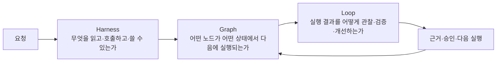

# Graph Engineering

Graph engineering은 AI에게 일을 잘 시키는 프롬프트 기법이 아니라, **업무 실행의 상태·분기·병렬성·복구를 읽을 수 있는 그래프로 설계하는 방법**이다. 이 저장소에서는 하네스가 실행의 경계를 만들고, 그래프가 다음에 실행할 일을 결정하며, 루프가 결과를 관찰하고 다음 실행에 반영하도록 연결한다.

이 문서는 특정 제품이나 기업의 내부 아키텍처를 재현하지 않는다. 공개된 원칙을 이 저장소의 업무 파일럿·프로젝트 색인에 적용할 수 있는 설계 계약으로 번역한 학습 자료다.

## 먼저 구분할 세 가지



| 층 | 다루는 질문 | 대표 통제 | 실패를 보는 관점 |
|---|---|---|---|
| Harness | AI가 무엇에 접근하고 어떤 결과를 낼 수 있는가? | 권한, 도구 allowlist, 출력 계약, 비밀값·개인정보 경계 | 위험한 도구 호출·범위 밖 출력·계약 위반 |
| Graph | 어떤 상태에서 어떤 노드가 실행되는가? | 노드, 엣지, 라우팅, fan-out/join, checkpoint, interrupt | 잘못된 분기·join 누락·무한 순환·복구 불가 |
| Loop | 결과를 어떻게 평가하고 다음 실행으로 돌려보내는가? | trace, 검증, 사람 검토, 예산, 재시도·종료 기준 | 같은 실패 반복·진전 없는 재시도·승격 근거 부족 |

그래프는 Harness를 대체하지 않는다. 그래프가 `write` 노드로 연결되어 있어도 하네스가 쓰기 권한을 허용하지 않으면 실행은 승인 대기 또는 보류로 끝나야 한다.

## 원문과 참고자료의 경계

이 가이드의 출발점은 사용자가 공유한 [@0xwhrrari의 X 게시물](https://x.com/0xwhrrari/status/2086784668003598356?s=46)이다. X 게시물의 본문·이미지가 이 환경에서 완전하게 추출되지 않을 수 있으므로, 게시물의 문장을 그대로 인용하거나 게시자의 의도를 단정하지 않는다. 아래 공개 자료와 오픈소스 구현을 교차 확인해 `Harness = consequence`, `Graph = state`, `Loop = time/feedback`이라는 설계 축과 실행 가능한 문서 계약으로 정리했다.

- [Agentic Engineering: Harness, Graph, Loop 관점](https://www.coldmountain.ai/wiki/tools/agentic-engineering) — 세 층의 역할과 장애 분리
- [Three Agent Engineering Architectures](https://todayforai.com/en/guides/20260726-guide-three-agent-engineering-architectures) — 그래프의 분기·병렬·join·human interrupt와 적용 조건
- [LangGraph](https://github.com/langchain-ai/langgraph) — 상태 그래프와 checkpoint를 구현할 때 읽을 오픈소스 참고점
- [Temporal](https://github.com/temporalio/temporal) — 장기 실행·durability·재개 가능한 workflow 참고점
- [Prefect](https://github.com/PrefectHQ/prefect) — task/flow·관찰성·재시도 정책 참고점
- [NetworkX](https://github.com/networkx/networkx) — 그래프 구조를 분석·검사하는 일반 라이브러리 참고점

## Graph engineering이 다루는 것과 다루지 않는 것

### 다루는 것

- `node`: 검색, 분류, 검증, 합성, 승인, 쓰기처럼 한 가지 책임을 가진 실행 단위
- `edge`: 성공, 실패, 재시도, escalation, 병렬 분기, join, 보상(compensation) 같은 전이
- `state`: 실행 전체가 공유하는 입력·중간 결과·근거·결정·예산·권한 상태
- `checkpoint`: 중단·장애 뒤에 마지막으로 신뢰할 수 있게 재개할 위치
- `trace`: 어떤 노드가 어떤 입력·도구·근거로 실행되었는지 확인할 기록
- `gate`: 사람 승인, 정책 검증, 데이터 최신성, 비용·시간 예산 같은 승격 조건

### 혼동하지 않는 것

Graph engineering에서 말하는 그래프는 **업무 실행 그래프**다. 지식 그래프의 엔티티·관계 모델, 데이터 파이프라인의 lineage DAG, 그래프 신경망의 학습 구조와 목적이 다르다. 하나의 시스템에 함께 존재할 수는 있지만, 이 문서의 `node`와 `edge`는 우선 “다음에 어떤 작업을 실행할 것인가”를 표현한다.

## 언제 그래프로 승격할 것인가

그래프를 먼저 만들지 말고, 실제 trace에서 구조적 복잡성이 반복되는지 확인한다.

| 상황 | 권장 설계 |
|---|---|
| 입력 하나를 받아 한 번 답하고 끝남 | 단일 모델 호출 또는 결정론적 함수 |
| 실패 시 같은 작업을 제한적으로 재시도 | 작은 workflow와 명시적 retry 정책 |
| 업무 유형에 따라 다른 검증·도구가 필요함 | 조건부 route가 있는 그래프 |
| 독립적인 사실·정책·최신성 확인을 동시에 수행함 | fan-out → join 그래프 |
| 사람 승인 뒤에만 쓰기·외부 전송이 가능함 | human gate와 resume 가능한 checkpoint |
| 장시간 실행, 재개, 보상 처리가 필요함 | durable graph와 명시적 compensation 경로 |
| 노드가 너무 많고 전이가 계속 바뀜 | 먼저 trace를 정리하고 책임 경계를 줄임 |

### Trace first, formalize second

1. 기준선 업무를 작은 입력으로 실행한다.
2. 요청, 도구 호출, 상태 변화, 오류, 승인, 최종 결과를 trace에 남긴다.
3. 같은 분기·검증·복구가 반복될 때만 노드와 엣지로 이름 붙인다.
4. 읽기 전용 그래프로 먼저 재현한다.
5. 독립 검증과 사람 승인 뒤에만 쓰기·외부 전송을 연결한다.

그래프의 존재 자체를 성과로 보지 않는다. 그래프가 분기와 실패를 더 잘 설명하고, 같은 입력에서 재현 가능하며, 보류·재개·승인 상태를 읽을 수 있을 때만 설계 개선으로 인정한다.

## 실행 계약: node, edge, state

### 노드 계약

모든 노드는 다음 질문에 답할 수 있어야 한다.

| 필드 | 의미 |
|---|---|
| `node_id`, `node_type` | trace와 상태에서 식별할 이름과 역할 |
| `input_schema`, `output_schema` | 읽고 내보낼 구조와 필수 필드 |
| `allowed_tools` | 호출 가능한 도구와 읽기·쓰기 권한 |
| `evidence_required` | 결과를 확정하기 위해 필요한 출처·버전·근거 |
| `timeout`, `retry_budget` | 오래 걸리거나 실패할 때의 상한 |
| `side_effect` | `none`, `draft`, `write`, `external_send` 중 영향 수준 |
| `owner`, `approval_required` | 책임자와 사람 승인 필요 여부 |
| `on_failure` | `retry`, `review`, `blocked`, `fallback`, `compensate` 중 처리 |

### 엣지 계약

엣지는 단순한 화살표가 아니라 전이 조건이다.

- `success`: 출력 계약과 최소 검증을 통과한 정상 전이
- `failure`: 오류·계약 위반을 오류 처리 노드로 보내는 전이
- `retry`: 같은 노드를 다시 실행하되 횟수·backoff·예산을 소모하는 전이
- `route`: state의 분류 결과에 따라 하나의 경로를 선택하는 전이
- `parallel`: 서로의 쓰기 결과에 의존하지 않는 노드를 fan-out하는 전이
- `join`: 병렬 결과를 합치기 전 누락·충돌·타임아웃을 확인하는 전이
- `interrupt`: 사람 승인이나 추가 자료를 기다리며 checkpoint에 멈추는 전이
- `compensate`: 이미 발생한 side effect를 되돌리거나 운영자에게 escalation하는 전이

### 상태 계약

상태는 모델의 자연어 메모리가 아니라, 재개·검증·감사의 기준이 되는 구조화된 값이다.

```yaml
graph_run:
  run_id: "run-2026-08-18-001"
  graph_id: "approved-doc-qna-v1"
  status: "waiting_human_approval"
  input_ref: "request-001"
  checkpoint: "human_approval"
  budget:
    max_seconds: 120
    max_model_calls: 6
    retries_used: 1
  evidence_refs:
    - "approved-doc:v1.2#section-3.1"
  decision:
    confidence: "review_required"
    next_action: "owner-approval"
```

재시작할 때는 마지막 자연어 응답을 믿지 말고 `run_id`, `checkpoint`, 노드별 상태, 사용한 evidence, side effect 여부를 읽는다. 중복 쓰기를 막기 위해 쓰기 노드는 idempotency key와 사전 diff를 가져야 한다.

재사용할 수 있는 최소 계약 예시는 [`examples/graph-run-contract.yaml`](../examples/graph-run-contract.yaml)에 있다.

## 표준 업무 토폴로지

아래 구조는 이 저장소의 `examples/pilot-charter.md`를 그래프로 표현한 첫 읽기 전용 형태다.

```mermaid
flowchart TD
    A["요청 범위 확정"] --> B["데이터 등급·권한 확인"]
    B --> C{ "승인된 범위인가?" }
    C -->|"아니오"| Z["보류·운영자에게 반환"]
    C -->|"예"| D["승인된 자료 검색"]
    D --> E1["사실·근거 확인"]
    D --> E2["정책·개인정보 확인"]
    D --> E3["최신성·버전 확인"]
    E1 --> F["Join: 검증 결과 병합"]
    E2 --> F
    E3 --> F
    F --> G["초안 합성"]
    G --> H["독립 검토자"]
    H --> I{ "근거·형식·정책 통과?" }
    I -->|"아니오"| R["수정·재검토 또는 blocked"]
    R --> G
    I -->|"예"| J{ "업무 반영 승인?" }
    J -->|"대기"| K["Checkpoint: 사람 승인"]
    K --> J
    J -->|"아니오"| Z
    J -->|"예"| L["쓰기·외부 전송"]
    L --> M["반영 결과·diff 확인"]
    M --> N["trace·KPI·실패 분류"]
    N --> O["다음 실행의 테스트·규칙·SOP"]
    O --> A
```

### 병렬성과 join의 규칙

병렬 실행은 빠르게 보이기 위한 장식이 아니다.

1. fan-out된 노드는 서로의 변경 결과에 의존하지 않아야 한다.
2. 각 노드는 성공·실패·타임아웃을 별도로 반환해야 한다.
3. join은 “모두 성공”만 가정하지 말고 누락·충돌·부분 성공을 판정해야 한다.
4. join 결과에는 원본 node run과 evidence의 ID를 보존한다.
5. 하나라도 필수 검증이 실패하면 합성으로 밀어붙이지 말고 `review`·`blocked`로 닫는다.

## 그래프 안의 네 가지 루프

| 루프 | 반복 단위 | 종료 조건 | 반드시 기록할 것 |
|---|---|---|---|
| Agent loop | 관찰 → 도구 호출 → 결과 해석 | 목표 달성, 도구 실패, turn budget 소진 | 도구 입력·출력·다음 행동 이유 |
| Verification loop | 초안 → 독립 검증 → 수정 | 필수 근거·정책·형식 통과 또는 보류 | 검증 결과와 수정 diff |
| Event loop | 이벤트 → route → 작업 → 상태 갱신 | 처리 완료, 중복 방지, escalation | event id, idempotency key, checkpoint |
| Improvement loop | trace → 분류 → 테스트·규칙 업데이트 | 다음 파일럿에서 재현 가능한 개선 | 실패 taxonomy, 변경 사유, 비교 결과 |

루프마다 별도의 상한을 둔다. 에이전트 turn 상한, 검증 재시도 상한, 이벤트 재처리 상한, 개선 실험의 승격 기준을 한 숫자로 섞지 않는다.

## 실패 진단표

| 증상 | 먼저 의심할 층 | 확인할 trace | 설계 조치 |
|---|---|---|---|
| 모델이 같은 도구를 반복 호출함 | Loop / Graph | turn count, retry count, exit edge | backoff·예산·종료 엣지 추가 |
| 정답 자료를 찾았는데 틀린 경로로 감 | Graph | route 입력과 분류 결과 | route 조건을 구조화하고 테스트 고정 |
| 권한 없는 자료가 프롬프트에 들어감 | Harness | retrieval scope와 permission decision | 검색 범위·도구 allowlist를 실행 전 검사 |
| 병렬 검증 중 하나가 실패했는데 초안이 확정됨 | Graph / Harness | join 상태, 필수 evidence | fail-closed join과 `review` 상태 추가 |
| 승인 후 같은 변경이 두 번 반영됨 | Harness / Graph | idempotency key, write node run | 사전 diff·멱등성·compensation 경로 추가 |
| 실패를 수정했지만 다음 실행에서 반복됨 | Loop | failure taxonomy와 변경 사유 | 재현 테스트와 승격 기준을 함께 갱신 |

문제의 원인을 모델 품질 하나로 합치지 않는다. 다음 실행이 달라지지 않는다면 그래프 또는 루프 설계가 닫혀 있지 않은 것이다.

## 운영 승격 체크리스트

### 읽기 전용 단계

- [ ] 기준선과 동일한 입력으로 graph run을 재현할 수 있다.
- [ ] 모든 node run에 입력·출력 schema, 상태, 도구, evidence가 남는다.
- [ ] route·parallel·join·retry·interrupt·exit가 Mermaid와 실제 trace에서 일치한다.
- [ ] 권한 없는 데이터와 쓰기 도구는 실행 전에 차단된다.

### 검증 단계

- [ ] 검증자와 생성자가 같은 단일 신호만으로 자기 채점을 하지 않는다.
- [ ] 필수 evidence 누락·충돌·최신성 실패가 `review` 또는 `blocked`로 닫힌다.
- [ ] 재시도·시간·비용·turn budget의 상한과 backoff가 있다.
- [ ] 사람 승인 전에는 외부 전송·업무 시스템 쓰기가 일어나지 않는다.

### 쓰기·재개 단계

- [ ] write node에 idempotency key, 사전 diff, rollback 또는 compensation 경로가 있다.
- [ ] interrupt 뒤 checkpoint에서 중복 없이 재개할 수 있다.
- [ ] 운영자가 run·node·evidence·decision을 읽고 책임을 확인할 수 있다.
- [ ] 파일럿 전후 KPI와 실패 분류가 같은 조건으로 비교된다.

체크리스트를 통과하지 못한 그래프는 production workflow가 아니라 학습용·읽기 전용 파일럿으로 표시한다.

## 이 저장소에서의 학습 순서

1. [`docs/harness-design.md`](harness-design.md)에서 권한·출력·승인 경계를 먼저 읽는다.
2. [`docs/orchestration-and-loop.md`](orchestration-and-loop.md)에서 위험 기반 라우팅과 feedback loop를 읽는다.
3. [`examples/pilot-charter.md`](../examples/pilot-charter.md)의 업무 흐름을 위 표준 토폴로지에 매핑한다.
4. [`examples/graph-run-contract.yaml`](../examples/graph-run-contract.yaml)의 node·edge·state 계약을 수정해 본다.
5. 실제 구현을 붙이기 전에 같은 입력의 trace에서 route·join·실패·승인 상태를 재현한다.

최소 연습 과제는 `승인 문서 Q&A`다. `classify → permission → retrieve → parallel verification → join → draft → independent review → human approval`까지는 읽기 전용으로 만들고, `write`는 마지막에 mock으로만 연결한다. 성공 조건은 “답을 만들었다”가 아니라, 보류 이유와 다음 재개 위치까지 기록된다는 것이다.
