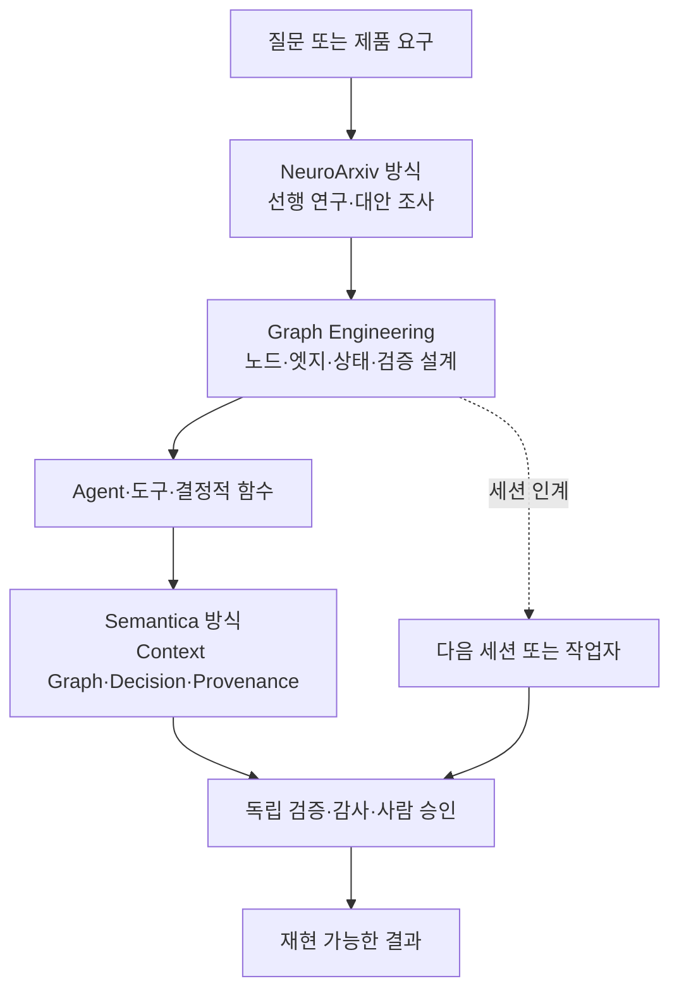

# AI STUDY: AI Agent 시스템을 읽고 설계하는 법

> 이 문서는 `chemark/ai-agent-book`의 10장 커리큘럼에 다음 자료를 연결해 읽기 쉽게 재구성한 한국어 학습 가이드다. 원문을 길게 복사하지 않고 핵심 주장, 개념의 경계, 실습 순서, 검증 포인트를 정리한다.
>
> 조사 기준일: 2026-08-14

## 30초 결론

이번 링크 묶음은 서로 다른 문제를 다룬다.

| 자료 | AI STUDY에서 맡는 역할 | 핵심 질문 |
| --- | --- | --- |
| Semantica | 지식·결정·근거를 구조화하는 컨텍스트 계층 | “이 Agent는 무엇을 알고, 왜 그렇게 결정했나?” |
| NeuroArxiv | 구현 전에 선행 연구를 확인하는 조사 계층 | “사람들이 이미 연구한 방법을 또 만들고 있지 않나?” |
| 세션 간 통신 팁 | 작업을 다른 세션이나 작업자에게 넘기는 협업 계층 | “다음 세션이 무엇을 이어서 해야 하나?” |
| Graph Engineering | Agent·도구·검증·사람을 연결하는 실행 계층 | “어떤 작업이 무엇에 의존하고, 어디서 병렬화·복구할 수 있나?” |
| `ai-agent-book` | 위 개념을 받쳐 주는 전체 커리큘럼 | “모델·컨텍스트·도구에서 평가·협업까지 어떻게 확장하나?” |

가장 중요한 구분은 이것이다.

- **Knowledge/Context Graph**는 시스템이 아는 사실, 엔티티, 관계, 결정, 출처를 표현한다.
- **Execution Graph**는 일을 수행하는 노드, 상태, 전이, 분기, 재시도, 승인 경로를 표현한다.
- **Session handoff**는 사람이 작업을 다른 세션에 넘길 때 필요한 운영 프로토콜이다.
- **NeuroArxiv 방식**은 실행 전에 근거를 조사하는 연구 절차다.

그래프라는 단어가 같아도 같은 기술은 아니다. 이 네 층을 섞으면 “그래프를 썼다”는 말만 남고 설계 의도는 사라진다.

## 전체 연결 지도



이 그림은 특정 제품을 반드시 함께 써야 한다는 뜻이 아니다. **근거를 조사하고, 실행 구조를 명시하고, 상태와 출처를 남기고, 독립적으로 검증한다**는 학습 순서를 보여 준다.

## 1. Semantica: Agent의 기억을 “검색 결과”에서 “추적 가능한 결정”으로

### 무엇인가

[Semantica 저장소](https://github.com/semantica-agi/semantica)는 자신을 “Context와 책임 있는 AI 시스템을 위한 graph-native infrastructure”로 설명한다. README의 핵심 구성은 다음과 같다.

- 여러 원천의 데이터를 ingest하고 정규화한다.
- 엔티티·관계·이벤트를 추출해 Knowledge Graph를 만든다.
- 충돌하는 사실과 중복 엔티티를 표시·정리한다.
- 사실과 결정에 provenance, 즉 출처와 계보를 붙인다.
- 결정 기록을 그래프의 1급 객체로 저장하고 원인·영향·유사 결정을 조회한다.
- 규칙, SHACL, Datalog, SPARQL 같은 결정적 방법으로 검증·추론한다.
- RDF와 Labeled Property Graph, 벡터 저장소 등 여러 저장 방식을 연결한다.

> 여기서 “오픈소스 Palantir”는 프로젝트가 스스로 내세우는 포지셔닝이다. 이 문서는 그 표현이나 성능을 독립적으로 보증하지 않는다.

### AI STUDY 핵심 개념

#### Context Graph

일반적인 임베딩 검색은 “질문과 비슷한 문서”를 찾는 데 강하다. Context Graph는 여기에 엔티티, 관계, 시간, 결정, 출처를 명시적으로 연결해 “무엇과 연결되어 있고, 어떤 근거에서 파생됐는가”를 묻는다.

따라서 학습할 때는 다음을 비교하면 된다.

| 방식 | 잘 답하는 질문 | 취약한 부분 |
| --- | --- | --- |
| 벡터 검색/RAG | 이 질문과 의미가 비슷한 내용은 무엇인가? | 관계·시간·충돌·결정의 계보를 별도로 보장하지 않으면 추적이 어렵다. |
| 일반 메모리 | 이전 대화에서 무엇을 말했나? | 사실의 출처와 현재 유효성 관리가 약할 수 있다. |
| Context Graph | 어떤 엔티티·관계·결정이 연결되어 있고 근거는 무엇인가? | 스키마·엔티티 정합·업데이트 비용이 생긴다. |

#### Decision Intelligence

결정을 단순한 로그 한 줄이 아니라 구조화된 노드로 저장한다. 그러면 다음 질문이 가능해진다.

1. 무엇을 결정했는가?
2. 어떤 상황과 근거에서 결정했는가?
3. 이전 결정 중 비슷한 사례가 있는가?
4. 이 결정이 어떤 후속 결과에 영향을 주었는가?
5. 정책이나 규칙을 통과했는가?

#### Provenance와 deterministic reasoning

Provenance는 “이 사실이 어디서 왔는가”를 기록하는 장치다. Deterministic reasoning은 적어도 일부 판단을 재실행 가능한 규칙과 추론 엔진으로 처리하는 접근이다. 둘을 함께 두면 LLM의 자연어 설명만 믿는 대신, 출처·규칙·그래프 경로를 별도로 검사할 수 있다.

### 무엇을 직접 공부할까

1. 같은 사실 세 개를 문서, 데이터베이스, Agent 출력에서 각각 가져온다.
2. 엔티티와 관계를 직접 정의한다. 예: `사람 → 소속 → 조직`, `결정 → 근거 → 문서`.
3. 서로 모순되는 사실과 중복 이름을 일부러 넣는다.
4. 어떤 사실이 채택되었는지, 어느 출처를 따라 결정되었는지 기록한다.
5. 최종 답변이 아니라 **결정 경로와 근거 목록**을 먼저 출력하게 한다.

README에 제시된 API에는 `ContextGraph.record_decision()`, `add_causal_relationship()`, `trace_decision_chain()`, `find_similar_decisions()` 같은 개념이 등장한다. 실제 API와 버전은 저장소의 최신 문서를 다시 확인하고, 아래와 같은 흐름을 개념 실습으로 삼는다.

```python
# 개념 실습: 실제 실행 전 현재 README와 API를 확인한다.
decision_id = graph.record_decision(
    category="architecture_choice",
    scenario="검색 기반 Agent의 근거 추적 방식 선택",
    reasoning="관계와 출처를 함께 조회해야 하므로 그래프 계층을 추가한다",
    outcome="use_context_graph",
)

graph.add_causal_relationship(
    evidence_id,
    decision_id,
    relationship_type="CAUSED",
)

trace = graph.trace_decision_chain(decision_id)
```

학습 결과는 “Semantica가 좋아 보인다”가 아니라 **한 결정이 어떤 데이터와 규칙에 의해 만들어졌는지 재현할 수 있는가**여야 한다.

## 2. NeuroArxiv: 코딩 전에 “이미 연구된 것”을 확인하는 습관

### 무엇인가

[NeuroArxiv 저장소](https://github.com/UditAkhourii/neuroarxiv)는 Claude가 복잡한 아키텍처·알고리즘·시스템을 설계하기 전에 arXiv의 선행 연구를 조사하도록 만드는 skill/CLI다. 단순 검색 결과를 나열하는 것이 목표가 아니라, 여러 논문을 분리해 읽고 하나의 구현 방향으로 수렴시키는 절차가 핵심이다.

저장소 README가 제시하는 흐름은 다음과 같다.

```text
문제 정의
  → 3–5개 arXiv 범주·검색어로 분류
  → 실제 HTTP로 논문 메타데이터·초록 수집
  → 논문 하나씩 독립 분석
  → 관련성·실용성·엄밀성 평가 및 기술 경로 클러스터링
  → 하나의 추천안, 첫 구현 단계, 위험, 선행 연구의 한계로 수렴
```

### 이 방식이 가르치는 것

- “새로운 구조를 만들어 보자”보다 먼저 “이미 있는 방법과 실패 사례가 무엇인가”를 묻는다.
- 여러 논문을 한꺼번에 읽게 해 서로의 표현에 끌려가는 anchoring을 줄이려 한다.
- 우승한 논문만 칭찬하지 않고, 선택하지 않은 경로의 한계도 기록한다.
- 최종 산출물을 링크 묶음이 아니라 **실행할 하나의 선택지 + 첫 단계 + 위험 목록**으로 만든다.

### 평가 수치를 읽는 법

프로젝트 README는 자체 평가에서 “논문 자체의 한계를 발견한 문제”가 일반 Claude 0/5, Web + arXiv 0/5, NeuroArxiv 5/5였다고 보고한다. 동시에 arXiv 중심 검색은 일반 웹 검색보다 인용 범위가 좁아 5개 문제 중 2개에서 citation breadth를 놓쳤다고 적는다.

이 수치는 **프로젝트가 보고한 평가 결과**이지, 이 문서가 독립적으로 재현한 벤치마크 결과가 아니다. 공부할 때는 숫자보다 평가 설계를 먼저 읽는다.

- 같은 모델·같은 문제·같은 예산인가?
- “한계를 발견했다”의 판정 기준이 사전에 정해졌는가?
- 논문 원문과 초록만의 차이는 무엇인가?
- 일반 웹 검색의 검색 품질과 NeuroArxiv의 절차 효과가 분리되어 있는가?
- 5개 문제 밖에서도 같은 결과가 나오는가?

### 직접 재현할 미니 평가

1. 아키텍처 질문 다섯 개를 만든다.
2. `cold`, 일반 웹 + arXiv, NeuroArxiv 절차의 세 조건을 만든다.
3. 각 답변에서 실제로 인용한 논문의 한계를 구체적으로 지적했는지 채점한다.
4. 추천안의 실행 가능성, 인용 범위, 위험 설명을 별도 점수로 기록한다.
5. 결과가 좋아도 “arXiv에서 다루지 않는 자료를 놓쳤다”는 한계를 함께 남긴다.

## 3. 세션 간 통신: 가벼운 인계와 durable state의 차이

[MinLiBuilds의 게시물](https://x.com/MinLiBuilds/status/2085951473981268182)은 두 세션을 이름으로 구분한 뒤 한 세션이 다른 세션에게 작업을 전달하는 방법을 소개한다.

```text
1. 각 세션을 /rename으로 구분한다. 예: jack, tom
2. jack에게 tom에게 특정 메시지를 전달하라고 말한다.
```

### AI STUDY에서의 의미

이 팁은 “세션을 사람처럼 식별해 작업을 넘긴다”는 운영 아이디어를 보여 준다. 여러 Agent를 연결할 때 필요한 최소 개념은 다음과 같다.

- 누가 작업을 맡고 있는가?
- 입력과 산출물은 무엇인가?
- 어디까지 끝났는가?
- 다음 작업자는 어떤 파일·메시지·근거를 읽어야 하는가?
- 실패하거나 세션이 사라졌을 때 다시 시작할 수 있는가?

다만 `/rename`과 “다른 세션에게 말하기”만으로는 durable state, 권한 관리, 재시도 시 중복 방지, 메시지 순서 보장, 감사 로그가 생기지 않는다. 따라서 이 게시물은 **세션 운영 팁**으로 이해하고, 프로덕션 메시지 버스나 작업 큐의 보장으로 확대 해석하지 않는다. 실제 명령의 지원 여부도 사용하는 Agent 런타임에서 확인해야 한다.

### 재사용 가능한 인계 카드

```yaml
session: research-01
goal: "논문 기반 Agent 아키텍처 후보를 비교한다"
status: in_progress
input:
  - "사용자 요구사항 문서 경로"
output:
  - "docs/evidence/research-01.md"
evidence:
  - "논문 ID 또는 URL"
next_action: "후보 3개를 하나의 추천안으로 수렴"
blockers: []
```

핵심은 세션 이름이 아니라 **인계 가능한 상태와 산출물**이다. 이름은 사람에게 편리한 라벨이고, 파일·ID·상태·근거가 시스템의 복구 지점이다.

## 4. Graph Engineering: Agent 시스템을 선형 프롬프트에서 실행 그래프로

[rari의 게시물](https://x.com/0xwhrrari/status/2086784668003598356)은 X Article인 “Graph Engineering: How to Build AI Agent Systems That Don't Break at Scale”로 연결된다. 원문은 Agent 작업을 `조사 → 작성 → 검토 → 배포`의 긴 직선으로만 만들면, 독립적인 일이 불필요하게 기다리고 실패 복구가 어려워진다고 설명한다.

### 기본 정의

Graph Engineering은 Agent를 많이 만드는 기술이 아니다. **Agent, 도구, 결정적 함수, 검증기, 사람 승인 단계를 노드로 나누고, 상태가 어떤 엣지를 통해 이동할지 명시하는 실행 설계**다.

### 원문에서 뽑은 12개 설계 원칙

1. **가짜 의존성을 끊는다.** 다음 단계가 이전 결과를 실제로 읽지 않으면 기다리게 하지 않는다.
2. **노드에 계약을 준다.** 한 가지 책임, 명시적 입력, 구조화된 출력, 분명한 실패 상태가 필요하다.
3. **엣지를 데이터 계약으로 본다.** “순서상 다음”이 아니라 “어떤 데이터가 전달되는가”를 정의한다.
4. **네 가지 형태를 익힌다.** Chain, Diamond, Router, Controlled Cycle을 조합한다.
5. **독립 작업은 fan-out하고 필요한 시점에만 join한다.** 병렬화 자체를 목적화하지 않는다.
6. **라우팅을 검사 가능하게 만든다.** 모델은 판단할 수 있지만, 허용된 경로와 권한은 그래프가 제한한다.
7. **검증을 경로에 둔다.** 생성 Agent가 자기 결과를 같은 맥락에서 승인·배포하지 않게 한다.
8. **상태를 내구성 있게 저장한다.** 큰 대화 전문을 복사하기보다 산출물 경로·ID·구조화 요약을 전달한다.
9. **수렴하는 사이클만 허용한다.** 완료 기준, 최대 라운드, 비용 예산, 이전 시도 기록, 실패 시 escalation이 있어야 한다.
10. **실패를 지역 사건으로 만든다.** 체크포인트, 멱등 쓰기, 분리된 작업공간, 라우팅 기록으로 한 노드의 실패가 전체를 멈추지 않게 한다.
11. **토폴로지를 비용 모델로 본다.** 강한 모델은 분해·합성·어려운 검증에, 값싼 모델과 코드는 추출·분류·정규화에 배치한다.
12. **연구·게시 그래프를 명시한다.** 범위 설정 → 독립 조사 → 정규화 → 초안 → 검사 → 부분 수정 → 사람 승인 순서로 소유권과 권한을 드러낸다.

### 네 가지 그래프 형태

| 형태 | 언제 쓰나 | 주의점 |
| --- | --- | --- |
| Chain | 매 단계가 직전 출력에 실제로 의존할 때 | 간단하지만 가짜 대기가 많아지기 쉽다. |
| Diamond | 여러 독립 조사·검토를 병렬 실행한 뒤 합칠 때 | join 전에 공통 스키마와 실패 정책이 필요하다. |
| Router | 입력 상태에 따라 필요한 경로만 선택할 때 | 모델의 분류와 시스템의 허용 경로를 분리한다. |
| Controlled Cycle | 불완전한 결과를 증거에 따라 재시도할 때 | “좋아질 때까지”가 아니라 정량적 종료 기준이 있어야 한다. |

### 언제 그래프를 쓰지 않을까

짧은 작업, 하나의 컨텍스트로 충분한 작업, 독립 분기가 없는 작업, 실패 비용이 낮고 사람이 즉시 검토할 수 있는 작업은 한 Agent의 loop가 낫다. 그래프는 복잡해 보이기 위해 도입하는 장식이 아니다.

그래프로 넘어갈 근거는 병렬화, 서로 다른 도구·권한, 독립 검증, 중단 후 재개, 공유 상태, 경로별 비용·권한 통제가 실제로 필요할 때다.

## 5. 네 자료를 하나의 학습 프로젝트로 묶기

### 프로젝트: 근거 기반 Agent 설계 메모 생성기

목표는 “멋진 멀티 Agent 데모”가 아니라 **아키텍처 선택의 근거와 실패 경로가 남는 작은 시스템**이다.

#### 1단계: 질문 정의

예: “문서 기반 고객지원 Agent에 단순 RAG를 쓸지, Context Graph를 추가할지?”

완료 기준은 “추천안을 하나 고르고, 근거 3개 이상과 위험 3개 이상을 기록한다”처럼 먼저 쓴다.

#### 2단계: NeuroArxiv식 사전 조사

질문을 연구 범주와 검색어로 나누고, 논문을 서로 독립적으로 읽는다. 각 기록에는 `문제`, `방법`, `적용 조건`, `한계`, `우리 문제와의 관련성`만 둔다. 마지막에 후보 하나를 선택하되, 선택하지 않은 후보가 탈락한 이유도 남긴다.

#### 3단계: Graph Engineering 설계

다음 노드를 계약과 함께 만든다.

| 노드 | 입력 | 출력 | 실패 상태 |
| --- | --- | --- | --- |
| Scope | 사용자 질문 | 질문·독자·완료 기준 | 질문이 모호함 |
| Research | 검색어·논문 목록 | 논문별 독립 메모 | 원문/초록을 가져오지 못함 |
| Normalize | 독립 메모 | 중복 제거된 근거 목록 | 출처 ID 누락 |
| Synthesize | 근거 목록 | 후보 비교와 추천안 | 근거가 부족함 |
| Verify | 초안·출처 | 통과/수정 요구 | 인용이 주장을 지지하지 않음 |
| Human gate | 검증 결과 | 게시 승인/반려 | 책임자가 승인하지 않음 |

Research 노드는 독립적으로 fan-out하고, Normalize에서만 합친다. Verify는 초안 작성과 다른 맥락에서 실행한다. 실패한 섹션만 Synthesize 또는 Research로 되돌리고 전체를 처음부터 반복하지 않는다.

#### 4단계: Semantica식 근거·결정 기록

근거 문서, 주장, 후보 아키텍처, 최종 결정을 그래프의 노드로 보고 관계를 붙인다.

```text
논문 A ──supports──> 주장 1
논문 B ──limits────> 주장 1
주장 1 ──influences> 후보 아키텍처
후보 아키텍처 ──causes──> 최종 결정
최종 결정 ──requires──> 검증 조건
```

이렇게 하면 “왜 이 구조를 골랐나?”에 대해 답변 텍스트만 보여 주는 것이 아니라, 출처와 반대 근거까지 따라갈 수 있다.

#### 5단계: 세션 인계

조사 세션이 끝나면 인계 카드를 남긴다. 다음 세션은 이전 대화 전체를 다시 읽지 않고 산출물 경로, 상태, 미해결 질문, 근거 목록부터 읽는다. 이 단계에서 `/rename`은 사람용 라벨이고, 실제 복구성은 문서·ID·체크포인트가 담당한다.

#### 6단계: 독립 검증과 사람 승인

다음 질문을 별도 검증 세션에 준다.

- 모든 핵심 주장에 출처가 있는가?
- 출처가 실제로 그 주장을 지지하는가?
- 선택하지 않은 대안의 단점도 공정하게 적었는가?
- 코드나 의사코드가 정의한 계약과 맞는가?
- 상태·재시도·비용·권한 경계가 설명되어 있는가?
- 사람이 최종 결과를 검토하고 승인했는가?

## 6. 기존 `ai-agent-book`과 함께 읽는 순서

이 저장소의 [학습 제안](../../docs/zh-CN/LEARNING.md)은 모델·컨텍스트·도구에서 시작해 평가·후훈련·자기 진화·멀티모달·멀티 Agent로 확장한다. 이번 자료를 그 흐름에 끼우면 다음 순서가 자연스럽다.

| 순서 | 기존 책 | 연결 자료 | 얻어야 할 것 |
| --- | --- | --- | --- |
| 1 | 1–2장 | Agent 기초·컨텍스트 | 모델, 컨텍스트, 도구의 역할을 분리한다. |
| 2 | 3장 | Semantica | 메모리·RAG·Knowledge Graph·provenance의 차이를 설명한다. |
| 3 | 4–5장 | 세션 인계 | 도구 호출과 Coding Agent의 상태·산출물을 넘기는 방법을 설계한다. |
| 4 | 6장 | NeuroArxiv 평가 | 자체 벤치마크의 주장과 평가 설계를 비판적으로 읽는다. |
| 5 | 10장 | Graph Engineering | 여러 Agent를 늘리기 전에 노드·엣지·상태·검증을 설계한다. |
| 6 | 7–9장 | 선택 심화 | 후훈련, 자기 진화, 음성·GUI·물리 세계로 확장한다. |

### 추천 학습 산출물

각 단계를 읽고 다음 네 개를 저장소에 남긴다.

1. 한 페이지 개념 요약
2. 노드·엣지·상태가 있는 작은 설계도
3. 주장·출처·한계 표
4. 직접 실행했는지, 문서만 읽었는지 구분한 검증 기록

“읽었다”와 “재현했다”를 같은 체크박스로 표시하지 않는 것이 중요하다.

## 7. 최종 체크리스트

### 구조

- [ ] 각 노드가 하나의 책임과 명시적 입력·출력을 갖는다.
- [ ] 각 엣지가 실제 데이터 의존성을 설명한다.
- [ ] 독립 작업만 병렬화하고 join 지점을 제한한다.
- [ ] 모델 판단과 시스템이 허용하는 라우팅을 분리한다.

### 근거와 상태

- [ ] 핵심 사실·결정·주장에 출처 ID가 있다.
- [ ] 충돌하는 사실을 조용히 덮어쓰지 않는다.
- [ ] 큰 대화 전문 대신 산출물 경로와 구조화 상태를 전달한다.
- [ ] 재시도는 멱등적이고 최대 횟수·비용 예산이 있다.

### 검증과 운영

- [ ] 생성과 검증을 서로 다른 맥락에서 수행한다.
- [ ] 실패가 가능한 한 작은 노드에 머문다.
- [ ] 자체 평가 수치와 독립 재현 결과를 구분한다.
- [ ] 사람 승인 전에는 게시·배포·외부 부작용을 실행하지 않는다.

## 출처와 범위

### 사용자가 제공한 링크

- [bakigulai: Semantica 소개](https://x.com/bakigulai/status/2085977214365896731)
- [AISuperDomain: NeuroArxiv 소개](https://x.com/AISuperDomain/status/2086728557355540727)
- [MinLiBuilds: 세션 간 통신 팁](https://x.com/MinLiBuilds/status/2085951473981268182)
- [0xwhrrari: Graph Engineering 원문 링크](https://x.com/0xwhrrari/status/2086784668003598356)
- [대상 저장소: chemark/ai-agent-book](https://github.com/chemark/ai-agent-book)

### 연결된 프로젝트

- [semantica-agi/semantica](https://github.com/semantica-agi/semantica)
- [UditAkhourii/neuroarxiv](https://github.com/UditAkhourii/neuroarxiv)

### 읽는 방법과 한계

- X 게시물의 설명은 프로젝트와 원문을 가리키는 출발점으로 사용했고, 구현·평가의 최종 근거는 연결된 저장소와 문서에서 다시 확인해야 한다.
- Semantica와 NeuroArxiv의 성능·평가 수치는 각 프로젝트가 보고한 주장과 독립 검증 결과를 구분해서 읽는다.
- 이 가이드에서는 원문 문장을 장문으로 재복사하지 않고 요약·비교·실습 질문으로 재구성했다.
- 여기서 제시한 실습 코드는 학습용 설계 예시다. 실제 설치·버전·API 호환성은 실행 시점의 각 저장소 문서를 확인한다.

