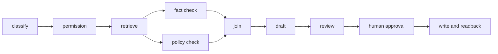

# Orchestration and loop design

## 위험 기반 라우팅

| 업무 유형 | 기본 흐름 | 추가 통제 |
|---|---|---|
| 공개 정보 요약 | 검색 → 요약 → 출처 확인 | 간단한 자동 평가 |
| 승인 문서 Q&A | 권한 확인 → 검색 → 초안 → 근거 검토 | 문서 버전 고정, 사람 승인 |
| 검사·품질 기록 | 구조화 → 기준선 비교 → 예외 표시 | 독립 검토, 반영 전 승인 |
| 고객 이슈 초안 | 분류 → 관련 기록 검색 → 원인 후보 → 초안 | 개인정보 마스킹, 담당자 승인 |
| 파일·시스템 변경 | 계획 → diff → 테스트 → 승인 → 반영 | 쓰기 권한 분리, rollback |

단순한 요청에 복잡한 다중 에이전트를 붙이지 않는다. 유연한 판단이 필요한 곳에만 agentic routing을 쓰고, 반복적이고 예측 가능한 업무는 결정론적 workflow로 남긴다.

## Graph로 실행 순서를 고정하기

오케스트레이션 표의 흐름이 실제 운영에서 반복되면 이를 실행 그래프로 승격한다. 그래프는 지식 그래프가 아니라 `어떤 상태에서 어떤 작업을 다음에 실행할지`를 표현하는 control-flow graph다.



그래프를 만들 때는 노드별 입력·출력 계약과 side effect를 먼저 적고, 실패·재시도·보류·재개 엣지를 함께 정의한다. 병렬 결과를 합치는 `join`은 부분 성공과 충돌을 검사해야 하며, 사람 승인 전에는 쓰기·외부 전송을 연결하지 않는다. 적용 기준과 실행 계약은 [Graph Engineering 가이드](graph-engineering.md)를 따른다.

## 루프 상태

```text
baseline
  -> pilot
  -> trace/readback
  -> eval + human review
  -> promote | review | blocked | rollback
  -> failure taxonomy
  -> test/prompt/rule/SOP update
  -> next pilot
```

## 승격 기준 예시

- 기준선 대비 처리시간은 줄었지만 수정률·예외 누락이 늘지 않았는가?
- 모델이 답을 만들었는지보다 담당자가 근거를 확인할 수 있는가?
- 데이터·약관·권한 조건이 다음 실행에서도 재현되는가?
- 실패 결과를 자동으로 확정하지 않고 보류·fallback하는가?
- 변경된 프롬프트·도구·모델·규칙이 기록되어 있는가?

## 실패를 다음 실행으로 돌려보내기

실패를 “모델이 나빴다” 한 줄로 닫지 않는다. 입력 누락, 출처 충돌, 권한 부족, 도구 오류, 출력 형식 오류, 사람 승인 지연, 평가 데이터 부적격처럼 원인을 나누고 각각을 다음 테스트 케이스에 연결한다.
